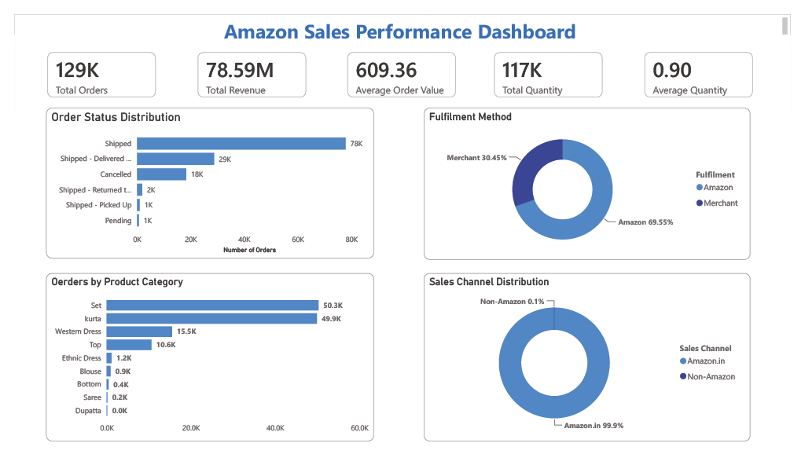
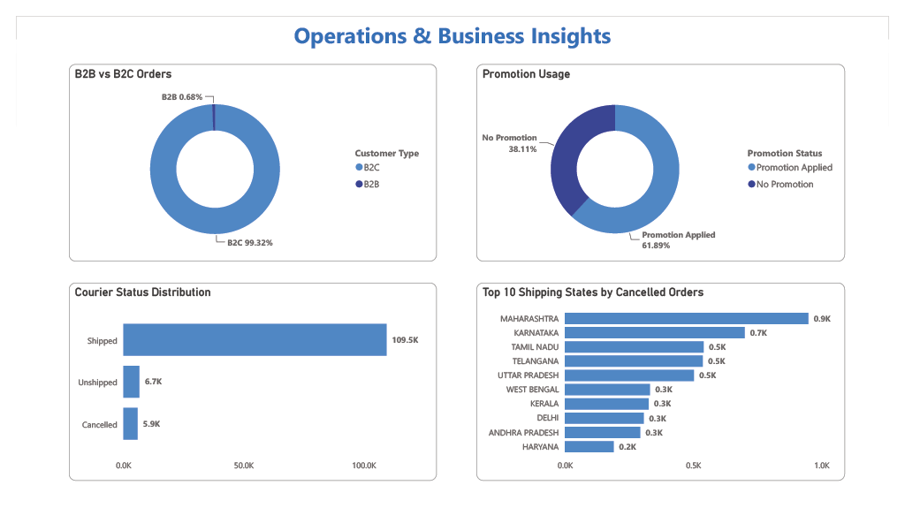
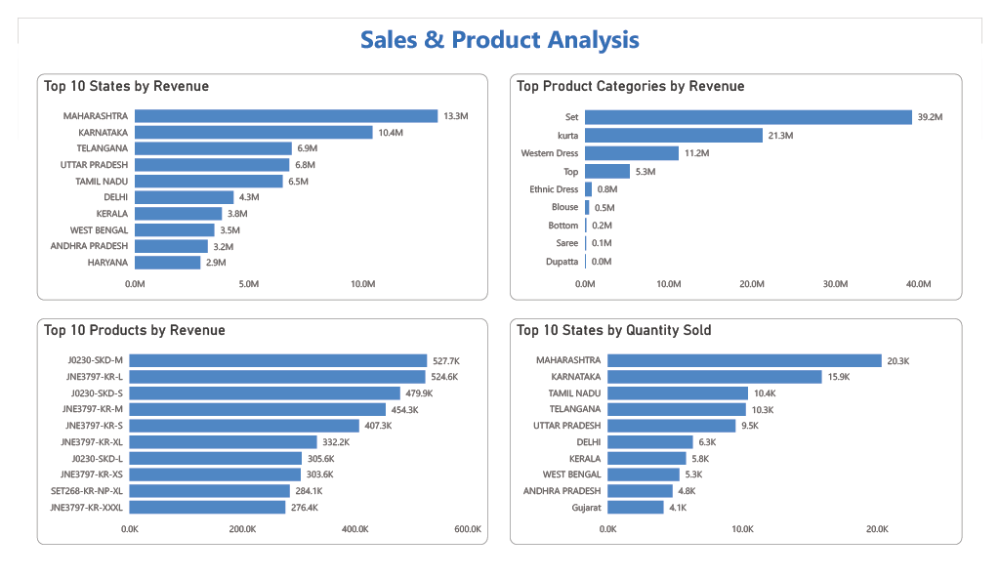
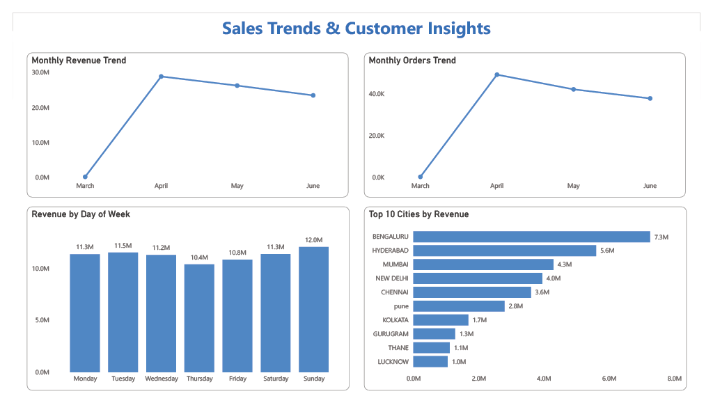

# 📊 Amazon Sales Analytics Dashboard

> **End-to-End Business Intelligence Project | Excel • MySQL • Power BI**


---

## Executive Summary

This flagship Business Analyst portfolio project demonstrates a complete analytics workflow—from raw transactional data to executive-ready dashboards and business recommendations.

Using **Excel**, **MySQL**, and **Power BI**, I analyzed **128,975 Amazon orders**, uncovering operational bottlenecks, customer purchasing patterns, regional sales trends, fulfillment performance, and product opportunities.

---

# Dashboard Preview

> Replace the paths below with your repository image paths.

## Executive Dashboard



## Operations & Business Insights



## Sales & Product Analysis



## Sales Trends & Customer Insights



---

# Business Problem

Amazon generates massive volumes of transactional data every day.

Without structured analysis it is difficult to answer questions such as:

- Which products generate the highest revenue?
- Which states drive business growth?
- How effective are promotions?
- Which fulfillment method performs best?
- Why are orders cancelled?
- Where should management invest next?

This project answers those questions using a complete Business Intelligence workflow.

---

# Project Objectives

- Clean and prepare raw sales data
- Perform SQL-based business analysis
- Build executive Power BI dashboards
- Generate actionable business insights
- Support data-driven decision making

---

# Tech Stack

| Tool | Purpose |
|------|---------|
| Microsoft Excel | Data Cleaning |
| MySQL | SQL Analysis |
| Power BI | Dashboard Development |
| DAX | KPI Calculations |
| Power Query | Data Transformation |
| Git & GitHub | Version Control |

---

# Dataset Overview

| Metric | Value |
|---------|------:|
| Total Orders | 128,975 |
| Revenue | ₹78.59 Million |
| Average Order Value | ₹609.36 |
| Quantity Sold | 116,649 |
| Customer Type | B2B & B2C |
| Industry | E-Commerce |

---

# Project Workflow

```text
Raw CSV
   │
   ▼
Excel Cleaning
   │
   ▼
MySQL Analysis
   │
   ▼
Business KPIs
   │
   ▼
Power BI Dashboard
   │
   ▼
Business Recommendations
```

---

# Key KPIs

| KPI | Result |
|------|-------:|
| Total Orders | 128,975 |
| Revenue | ₹78.59M |
| Average Order Value | ₹609.36 |
| Amazon Fulfillment | 69.55% |
| Merchant Fulfillment | 30.45% |
| B2C Orders | 99.32% |
| Cancellation Rate | 14.21% |

---

# Dashboard Highlights

### Executive Dashboard
- Overall business KPIs
- Order status distribution
- Product category performance
- Sales channel mix
- Fulfillment analysis

### Operations Dashboard
- Promotion analysis
- Courier performance
- B2B vs B2C
- Cancelled orders by state

### Sales Dashboard
- Revenue by state
- Top products
- Category performance
- Quantity sold

### Customer Dashboard
- Monthly trends
- Day-wise revenue
- Top cities
- Customer insights

---

# Business Insights

## Revenue

- ₹78.59M generated from nearly 129K orders.
- Maharashtra generated the highest revenue.

## Product Performance

- Set and Kurta dominate sales.
- Long-tail categories contribute minimal revenue.

## Fulfillment

- Amazon Fulfillment processes nearly 70% of orders.
- Merchant fulfillment remains a significant operational channel.

## Customer Behavior

- Most purchases are single-item orders.
- Promotions influence a majority of purchases.

## Sales Channels

- Amazon marketplace contributes almost all orders.

---

# Recommendations

- Expand high-performing categories
- Strengthen inventory in top-performing states
- Reduce cancellations
- Optimize promotional profitability
- Increase average order value using bundles
- Expand premium offerings

---

# Skills Demonstrated

- Business Analysis
- KPI Design
- SQL
- Data Cleaning
- Dashboard Design
- Executive Reporting
- Data Storytelling
- Power Query
- DAX
- Insight Generation
- Stakeholder Communication

---

# Repository Structure

```text
Amazon-Sales-Analytics/
│
├── Data/
├── SQL/
├── Power BI/
├── Dashboard Images/
├── Business Report/
├── README.md
└── LICENSE
```

---

# Business Value

This project demonstrates the ability to:

- Translate business questions into analytical solutions
- Build executive dashboards
- Transform raw data into strategic recommendations
- Present insights clearly for decision-makers

---

# Future Improvements

- Predictive sales forecasting
- Customer segmentation
- Inventory optimization
- Profitability analysis
- Geographic heat maps
- Automated refresh pipeline

---

# About Me

**Aryan**

Business Analyst | SQL | Power BI | Excel | Data Analytics

Passionate about transforming raw data into meaningful business insights.

---

⭐ If you found this project interesting, consider giving the repository a star.
